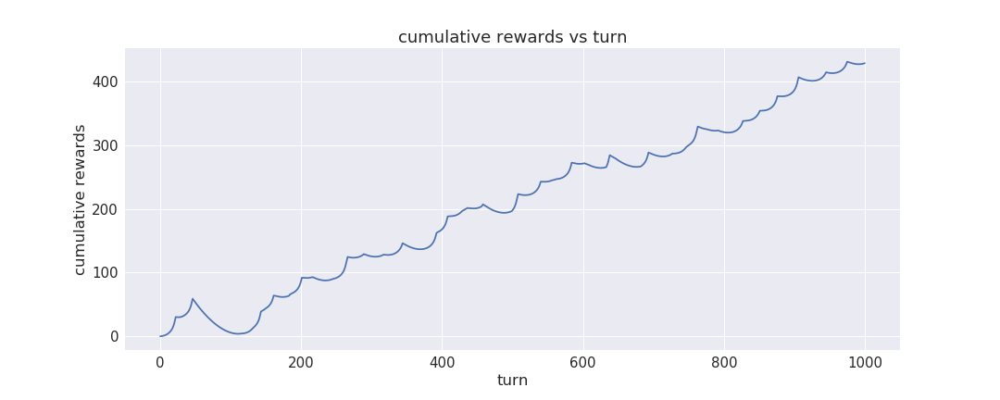
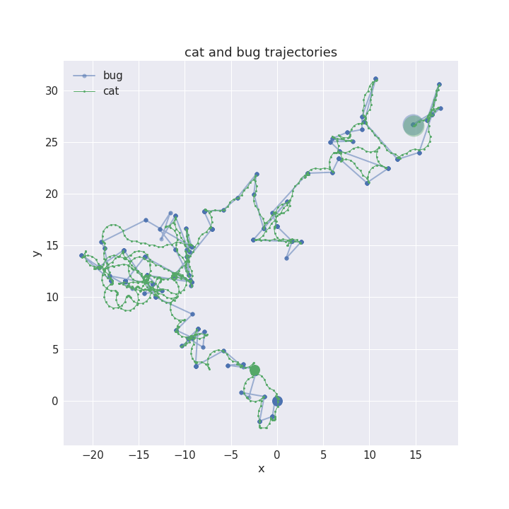
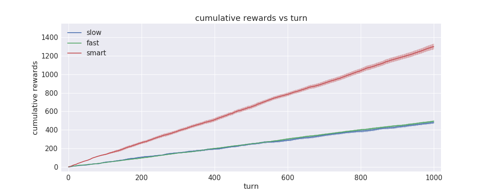
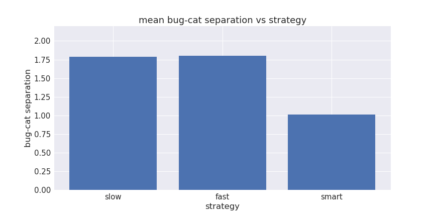

# cat-chase-grasshopper

by Joe Hahn, 
jmh.datasciences@gmail.com, 
8 February 2018 
git branch=master

### Summary:
This cat-chase-grasshopper demo uses Q-learning to teach a neural net AI to instruct
a virtual cat to chase after a virtual bug that hops away as the cat nears.

A secondary goal of this demo is to see if Q-learning can be used to solve
this optimization problem: imagine a box with two dials that can be used
to move an agent (the cat) towards the a moving target (the grasshopper). The goal
is to write self-learning code to turn the dials so that the agent-target separation stays
minimized, without knowing in advance how the agent will respond to twists of the
dials. Solution: use Q-learning to train the neural network to turn the dials so that
the cat chases the grasshopper as closely as possible.

### Setup:

Clone this repo:

    git clone https://github.com/joehahn/cat-chase-grasshopper.git
    cd cat-chase-grasshopper

I am executing cat-chase-grasshopper on a Mac laptop where I've installed
Anaconda python 2.7 plus additional libraries via:

    wget https://repo.continuum.io/miniconda/Miniconda2-latest-MacOSX-x86_64.sh
    chmod +x ./Miniconda2-latest-MacOSX-x86_64.sh
    ./Miniconda2-latest-MacOSX-x86_64.sh -b -p ~/miniconda2
    ~/miniconda2/bin/conda install -y jupyter
    ~/miniconda2/bin/conda install -y keras
    ~/miniconda2/bin/conda install -y seaborn

### Execute:

Start Jupyter notebook via

    jupyter notebook

and load the cat-chase-grasshopper.ipynb notebook > Run.

### Results:

Cat-chase-grasshopper is a 2D game composed of a virtual cat that is always chasing
a virtual grasshopper that hops away whenever the cat nears. The game is turn-based, and each
turn the cat can execute one of these actions: move slow or fast with a slight
25 degree turn to the left or right, or turn 180 degrees. So the cat has five possible
actions: move slow & turn left, move slow & turn right, move fast turn left, move fast
turn right, or turn around. Nearly straight motion is achieved by alternating
left and right turns.

The reason that the cat's movements are quantized is so that we can use Q-learning
to drive the cat towards the grasshopper. Q-learning is a fairly straightforward
and not-too-difficult reinforcement-learning algorithm, but one that is restricted
to discreet actions. If the cat was instead allowed a continuous choice of movements such as
variable speed or direction, then we would have to use much more complex algorithms
like actor-critic or DDPG, and that is not attempted here.
 
Helper functions are stored in chase.py, these functions are used to define
the game and initialize the bug & cat's x,y coordinates. Every turn the cat is given a
reward that increases as the bug-cat separation is reduced:

This varies roughly as reward ~ 1/separation - separation/5, and these rewards will be used
to train the AI to steer the cat towards the moving bug.

The bug's hopping motion is random, with the probability that the bug hops during a turn
varying as ~ constant/separation. The bug's hop has two components, a
random hop whose distance of order ~2 in any directon + a systematic hop whose distance
is ~1/separation in the direction away from the cat.

But before we train the AI to steer the cat, lets play one game of cat-chase-grasshopper
using a 'slow' strategy where the cat is preprogrammed to advance towards the bug
at the slower speed, and the following plot shows the cat's trajectory (green dots)
as it chases the hopping grasshopper as it random-walks (blue dots).
 
The large translucent dots show the cat and bug's final positions, and initial
positions are the intermediate dense dots. The plot below shows that rewards
that the cat accumulated during this game:

Now play this game again using a 'fast' strategy where the cat is preprogrammed
to always advance towards the bug at the 5x faster speed:
 
So after each hop, the cat can narrow the distance in less time, but because the cat
can only turn in 25 degree increments, the faster cat then has to make 
fairly wide orbits around the bug in order to scoop up rewards until the bug
hops away.

A wiser strategy would be to run fast after the bug hops and then slow down to receive greater
rewards as the slower cat makes tighter circles around the bug. Or overrun the bug
and turn 180 degrees. But we don't want to encode that strategy ourselves,
since it might not be optimal anyway. Instead, lets use Q-learning to train
a neural network to discover a more optimal cat-navigating strategy.
The simple neural network used here has two densely-connected hidden layers composed of 24
neurons each; this choice is inspired by the game's 2D geometry and the cat's 5 possible actions
so 5 squared made even is 24 neurons.

200 games are played while training the neural network, which takes about 8 minutes on
my Mac laptop's CPU. Note that porting this demo to a GPU won't save you any time, 
the data volumes are too small to benefit from GPU acceleration. Cat-chase-grasshopper
is then played using the 'smart' strategy with the trained neural net steering the cat: 
 
Close inspection shows that the AI-driven cat does indeed run fast between hops,
with 180s used to reverse the cat over the bug again. The distribution of actions selected by
the AI is:
 

Cat-chase-grasshopper is then played 20 more times for each of the cat-navigation
strategies (slow, fast, and smart), and the following shows the average rate
at which each strategy accumulates rewards:
 
Note that the programmatic slow and fast strategies accrue rewards at nearly identical rates,
while the AI-driven smart strategy generates rewards almost 3 times faster.
Of course our goal was to build a self-taught AI that outperforms the human-generated
slow & fast strategies, and that is demonstrated by following chart showing that the mean bug-cat
separation is almost 2 times smaller when the smart strategy is employed:

:thumbsup:

